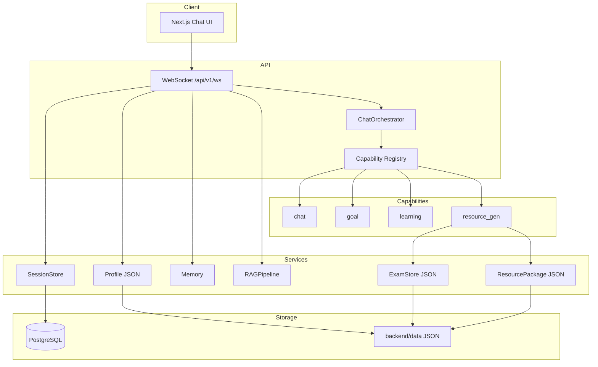
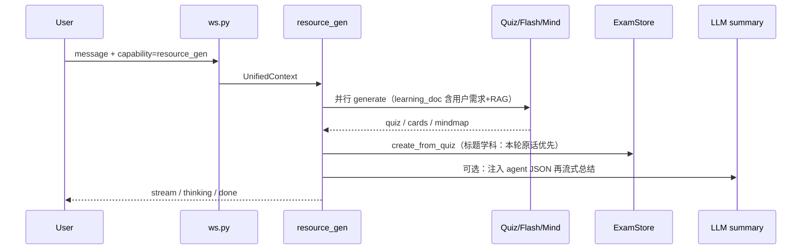

# ZhiPath 评委速览（单页）

> 多智能体个性化学习资源系统：Next.js 前端 + FastAPI 后端 + PostgreSQL/pgvector + RAG + DeepSeek/讯飞星火 LLM + 讯飞 TTS。

## 0. 三分钟看完的核心卖点

- **Auto-Tutor 一键闭环**（[capabilities/auto_tutor.py](../backend/capabilities/auto_tutor.py)）：诊断 → 多模态生成 → 试卷 → 自评 → 画像更新 → 重规划 → 报告，7 阶段多智能体协作一条流水线跑完。
- **5+ 类多模态资源**：讲义/测验/闪卡/思维导图/试卷/**代码实操（Pyodide 浏览器沙箱）/讲义音频（讯飞 TTS）**。
- **对话式画像 7 维度 + 证据链**：每条画像值挂第 N 轮原话证据，WebSocket 实时增量长出。
- **真实多智能体通信可视化**：StreamBus 新增 `agent_message` 事件，Agent 之间传的数据流可见。
- **防幻觉机制**：RAG 引用编号 + 相似度分 + 低置信度告警；输入侧关键词安全过滤；代码片段正则护栏。
- **赛题硬性要求合规**：接入科大讯飞星火 LLM（OpenAI 兼容）+ 讯飞超拟人 TTS（WebSocket）。

## 1. 系统架构（逻辑视图）

## 2. 单轮请求链路（WebSocket）

顺序与 `api/routers/ws.py` 中 `_handle_turn` 注释 **1)–10)** 一致：

1. 会话（无 `session_id` 时创建）
2. 持久化用户消息（DB）
3. **更新画像**（规则抽取，会话级 JSON 累积）
4. 拼接记忆上下文（画像摘要 + Memory）
5. **RAG** `build_context(user_message)` → `knowledge_context`
6. 取历史消息（**不含**当前用户句；当前句在 `context.user_message`）
7. 组装 `UnifiedContext` 并进入 `ChatOrchestrator` → `StreamBus`
8. 下发 `session` 帧（含 `session_id`）
9. 流式转发编排器事件（`stream` / `thinking` / `done` / `tool_*` 等）
10. 拼接 `CONTENT` 事件为助手正文并持久化（thinking/tool 不入库）

## 3. `resource_gen` 能力时序（核心卖点）

- **试卷标题**：`services/exam/store.py` — `_topic_from_source_prompt` 优先解析本轮用户话中的学科，避免仅用画像 `topics` 最后一项串题。
- **出题材料**：`capabilities/resource_gen.py` — 有 RAG 时把「本轮用户需求」置于 `learning_document` 前部，约束命题与检索片段一致。

## 4. 已知风险与缓解（批阅关注点）

| 风险 | 说明 | 缓解 |
|------|------|------|
| 画像 `topics` 累积 | 多轮主题叠在同一列表，旧逻辑易误用「最后一项」 | 试卷学科已改为**原话优先** |
| RAG 主导出题 | 检索片段学科/语言与用户需求不一致 | 用户需求前置进 `learning_doc` |
| 出卷关键词过宽 | 单独出现「word/pdf」易误判 | `_is_exam_export_request` 收紧：导出类需同时出现题/卷/考等语境 |
| 工具失败降级 | Agent 异常时仍可能走纯 LLM，结构化结果缺失 | `_invoke_agent` 有 thinking 提示；可继续加强 UI 提示 |
| DB + JSON 双存储 | 会话等走 PG；试卷/资源包走 `data/` | 见下表 |

## 5. 关键文件索引

| 职责 | 路径 |
|------|------|
| WebSocket 一轮编排 | `backend/api/routers/ws.py` |
| 能力路由 | `backend/runtime/orchestrator.py`、`runtime/registry.py` |
| 上下文载体 | `backend/core/context.py` |
| 资源生成 + 测验/试卷 | `backend/capabilities/resource_gen.py` |
| 试卷持久化与学科推断 | `backend/services/exam/store.py` |
| 学习者画像规则 | `backend/services/profile/service.py` |
| 通用流式 LLM 能力 | `backend/capabilities/llm_capability.py` |
| RAG | `backend/services/rag/pipeline.py` |
| 环境变量加载 | `backend/bootstrap_env.py` |

## 6. 启动与配置

- 数据库：`ZhiPath/docker-compose.yml`（默认 `learnflow/learnflow@localhost:5432`）
- 环境变量：`ZhiPath/.env`（`DATABASE_URL`、各 LLM `*_API_KEY`）
- 前端：`frontend` → `npm run dev`；后端：`backend` → `python main.py`

---

*本页与代码内注释同步维护，便于软件杯/课堂批阅快速理解数据流与责任边界。*
